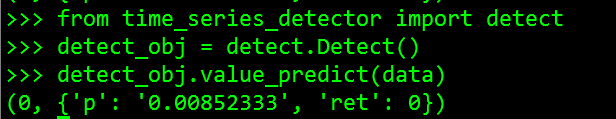
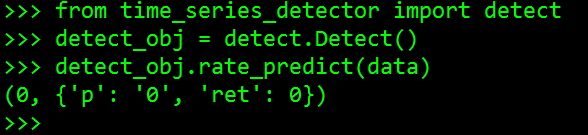

# API接口文档
## 时间序列异常检测接口

用户可根据场景选择使用API接口对时间序列进行异常检测：

1、量值检测：适用于大多数KPI指标数据的检测，使用无监督和有监督联合检测，会加载检测模型

2、率值检测：适用于正态分布类型数据的检测，使用无监督算法进行检测，如成功率等生死指标数据的检测

- HTTP接口调用请使用搭建的后端服务地址；Python接口可直接调用
- 当前检测时间窗口选取为3小时，每分钟1个数据点，即窗口值为180
- 同比数据日期和时间段的选择可根据实际情况调整，文档中两个同比数据分别取昨日和一周前的同比

针对当前一个值的检测，需要依赖过去三段数据，数据选取规则参考示例图：


### 一、HTTP接口

#### 1、量值检测

* API： POST /{ip}:{port}/PredictValue
* 功能说明：根据参考数据检测最近一个数据点是否异常
* 请求参数request：
	
```
{
    "viewId":"2012",
    "viewName":"登陆功能",
    "attrId":"19201",
    "attrName":"ptlogin登陆请求总量",
    "taskId":"1530608070706",
    "window":180,
    "time":"2018-10-17 17:28:00",
    "dataC":"9,10,152,...,255,...,16",
    "dataB":"9,10,152,...,255,...,18",
    "dataA":"9,10,152,...,458"
}
```

* request字段说明：

| 名称  | 类型 |必填| 默认值 | 说明 |
| --- | --- | --- |---- | --- |
| viewId| string| 是|无|指标集ID |
| viewName|  string| 是| 无|指标集名称|
| attrId|  string| 是| 无|指标ID|
| attrName|  string| 是| 无|指标名称|
| taskId|  string| 否| 无|使用的检测模型，如不传，则采用系统默认模型|
| window|  int| 是| 无|窗口值，目前支持180|
| time|  string| 是| 无|待检测点的时间标识，即dataA的最后一个点，格式："yyyy-MM-dd HH:mm:ss"|
| dataC|  string| 是| 无|待检测的1个点对应一周前同时刻的点 + 前后各180个数据，361个数据点按时间顺序拼接，英文逗号分隔|
| dataB|  string| 是| 无|待检测的1个点对应昨日同时刻的点 + 前后各180个数据，361个数据点按时间顺序拼接，英文逗号分隔|
| dataA|  string| 是| 无|待检测的1个点+前180个数据，共181个数据点，181个数据点按时间顺序拼接，英文逗号分隔|


* 详情参数response：
```
{
    "code":0,
    "msg":"操作成功",
    "data":
    {
        "ret":0,
        "p":"0.05",
    }
}
```

* response 字段说明：

| 名称  | 类型  | 说明 |
|---|---|---|
| code | int | 返回码。0:成功；非0:失败 |
| msg | string | 返回消息 |
| ret | int | 检测结果是否异常。0:异常；1:正常 |
| p | string | 概率值，值越小，判定为异常的置信度越高，目前p<0.15，判决为异常 |

#### 2、率值检测

* API： POST /{ip}:{port}/PredictRate
* 功能说明：根据参考数据检测最近一个数据点是否异常
* 请求参数request：
	
```
{
    "viewId":"2012",
    "viewName":"登陆功能",
    "attrId":"19201",
    "attrName":"ptlogin登陆成功率",
    "window":180,
    "time":"2018-10-17 17:28:00",
    "dataC":"100,99.8,100,...,100,...,100",
    "dataB":"99.5,100,100,...,99.6,...,100",
    "dataA":"100,98.5,100,...,85.9"
}
```

* request字段说明：

| 名称  | 类型 |必填| 默认值 | 说明 |
| ---  | ---  | --- |---  | --- |
| viewId| string| 是|无|指标集ID |
| viewName|  string| 是| 无|指标集名称|
| attrId|  string| 是| 无|指标ID|
| attrName|  string| 是| 无|指标名称|
| window|  int| 是| 无|窗口值，目前支持180|
| time|  string| 是| 无|待检测点的时间标识，即dataA的最后一个点，格式："yyyy-MM-dd HH:mm:ss"|
| dataC|  string| 是| 无|待检测的1个点对应一周前同时刻的点 + 前后各180个数据，361个数据点按时间顺序拼接，英文逗号分隔|
| dataB|  string| 是| 无|待检测的1个点对应昨日同时刻的点 + 前后各180个数据，361个数据点按时间顺序拼接，英文逗号分隔|
| dataA|  string| 是| 无|待检测的1个点+前180个数据，共181个数据点，181个数据点按时间顺序拼接，英文逗号分隔|


* 详情参数response：

```
{
    "code":0,
    "msg":"操作成功",
    "data":
    {
        "ret":0,
        "p":"0",
    }
}
```

* response 字段说明：

| 名称  | 类型  | 说明 |
|---|---|---|
| code | int | 返回码。0:成功；非0:失败 |
| msg | string | 返回消息 |
| ret | int | 检测结果是否异常。0:异常；1:正常 |
| p | string | 概率值，值越小，判定为异常的置信度越高 |

### 二、Python API

Metis工程目录下time_series_detector目录为时间序列异常检测学件，可以在python代码中直接调用

#### 1、量值检测
* 功能说明：根据参考数据检测最近一个数据点是否异常

* 调用方法： 

```
# Python
from time_series_detector import detect

detect_obj = detect.Detect()
detect_obj.value_predict(data)
```


* 传入参数：python字典
	
```
{
    "window":180,
    "dataC":"9,10,152,...,255,...,16",
    "dataB":"9,10,152,...,255,...,18",
    "dataA":"9,10,152,...,458"
}
```

* 传入参数说明：

| 名称  | 类型 |必填| 默认值 | 说明 |
| --- | --- | --- |---- | --- |
| taskId|  string| 否| 无|使用的检测模型，如不传，则采用系统默认模型|
| window|  int| 否| 无|窗口值，目前支持180|
| dataC|  string| 是| 无|待检测的1个点对应一周前同时刻的点 + 前后各180个数据，361个数据点按时间顺序拼接，英文逗号分隔|
| dataB|  string| 是| 无|待检测的1个点对应昨日同时刻的点 + 前后各180个数据，361个数据点按时间顺序拼接，英文逗号分隔|
| dataA|  string| 是| 无|待检测的1个点+前180个数据，共181个数据点，181个数据点按时间顺序拼接，英文逗号分隔|


* 返回参数：
```
    code, {
        "ret":0,
        "p":"0.05",
    }

```

* 返回参数说明：

| 名称  | 类型  | 说明 |
|---|---|---|
| code | int | 返回码。0:成功；非0:失败 |
| ret | int | 检测结果是否异常。0:异常；1:正常 |
| p | string | 概率值，值越小，判定为异常的置信度越高，目前p<0.15，判决为异常 |

* 调用案例：



#### 2、率值检测
* 功能说明：根据参考数据检测最近一个数据点是否异常

* 调用方法： 

```
# Python
from time_series_detector import detect

detect_obj = detect.Detect()
detect_obj.rate_predict(data)
```

* 传入参数：python字典
	
```
{
    "dataC":"9,10,152,...,255,...,16",
    "dataB":"9,10,152,...,255,...,18",
    "dataA":"9,10,152,...,458"
}
```

* 传入参数说明：

| 名称  | 类型 |必填| 默认值 | 说明 |
| ---  | ---  | --- |---  | --- |
| dataC|  string| 是| 无|待检测的1个点对应一周前同时刻的点 + 前后各180个数据，361个数据点按时间顺序拼接，英文逗号分隔|
| dataB|  string| 是| 无|待检测的1个点对应昨日同时刻的点 + 前后各180个数据，361个数据点按时间顺序拼接，英文逗号分隔|
| dataA|  string| 是| 无|待检测的1个点+前180个数据，共181个数据点，181个数据点按时间顺序拼接，英文逗号分隔|


* 返回参数：
```
    code, {
        "ret":0,
        "p":"0",
    }

```

* 返回参数说明：

| 名称  | 类型  | 说明 |
|---|---|---|
| code | int | 返回码。0:成功；非0:失败 |
| ret | int | 检测结果是否异常。0:异常；1:正常 |
| p | string | 概率值，值越小，判定为异常的置信度越高，目前p<0.15，判决为异常 |

* 调用案例：



### 三、LIB库
Metis工程目录下time_series_detector/lib为学件动态库目录，库文件可以在代码中加载调用

libdetect.so目前支持在CentOs7.2+系统环境下使用


#### Python代码中调用:

##### 1、量值检测
* 功能说明：根据参考数据检测最近一个数据点是否异常

* 调用方法： 

 加载so库：
 
```
# Python
so = cdll.LoadLibrary
metis_lib = so("./libdetect.so")
handle = metis_lib.load_model("./xgb_default_model")
```

  构造传入数据：
   
```
# Python
from ctypes import *

class ValueData(Structure):
    _fields_ = [('data_a', POINTER(c_int)), ('data_b', POINTER(c_int)), ('data_c', POINTER(c_int)),
                ('len_a', c_int), ('len_b', c_int), ('len_c', c_int)]

# test data
data_c = [1] * 361
data_b = [1] * 361
data_a = [1] * 180
data_a.append(10)

paarray = (c_int * len(data_a))(*data_a)
pbarray = (c_int * len(data_b))(*data_b)
pcarray = (c_int * len(data_c))(*data_c)
data_value = ValueData(paarray, pbarray, pcarray, len(data_a), len(data_b), len(data_c))  
```

调用计算函数：

```
#python
result = c_int()
prob = c_float()
ret_code = metis_lib.value_predict(handle, byref(data_value), byref(result), byref(prob))
if ret_code != 0:
    print "value_predict error code = %d" % ret_code
print result, prob
```


* 传入参数：C结构体
	
```
typedef struct {
    int* data_a;
    int* data_b;
    int* data_c;
    int len_a;
    int len_b;
    int len_c;
} ValueData;
```
* 传入参数说明：

| 名称  | 类型 |必填| 默认值 | 说明 |
| --- | --- | --- |---- | --- |
| handle|  int| 是| 无|模型句柄，由load_model返回|
| data_value|  ValueData| 是| 无|待检测数据|


* 返回参数：
```
ret_code
result
prob
```

* 返回参数说明：

| 名称  | 类型  | 说明 |
|---|---|---|
| ret_code | int | 返回码。0:成功；非0:失败 |
| result | c_int | 检测结果是否异常。0:异常；1:正常 |
| prob | c_float | 概率值，值越小，判定为异常的置信度越高，目前prob<0.15，判决为异常 |

##### 2、率值检测
* 功能说明：根据参考数据检测最近一个数据点是否异常

* 调用方法： 

 加载so库：
 
```
# Python
so = cdll.LoadLibrary
metis_lib = so("./libdetect.so")
```

  构造传入数据：
   
```
# Python
from ctypes import *

class RateData(Structure):
_fields_ = [('data_a', POINTER(c_double)), ('data_b', POINTER(c_double)), ('data_c', POINTER(c_double)),
            ('len_a', c_int), ('len_b', c_int), ('len_c', c_int)]

# test data
data_c = [1.0] * 361
data_b = [1.0] * 361
data_a = [1.0] * 180
data_a.append(0.9)

paarray = (c_double * len(data_a))(*data_a)
pbarray = (c_double * len(data_b))(*data_b)
pcarray = (c_double * len(data_c))(*data_c)
data_value = RateData(paarray, pbarray, pcarray, len(data_a), len(data_b), len(data_c))
```

调用计算函数：

```
#python
result = c_int()
prob = c_float()
ret_code = metis_lib.rate_predict(byref(data_value), byref(result), byref(prob))
if ret_code != 0:
    print "value_predict error code = %d" % ret_code
print result, prob
```


* 传入参数：C结构体
	
```
typedef struct {
    double* data_a;
    double* data_b;
    double* data_c;
    int len_a;
    int len_b;
    int len_c;
} RateData;
```
* 传入参数说明：

| 名称  | 类型 |必填| 默认值 | 说明 |
| --- | --- | --- |---- | --- |
| data_value|  RateData| 是| 无|待检测数据|


* 返回参数：
```
 ret_code
 result
 prob
```

* 返回参数说明：

| 名称  | 类型  | 说明 |
|---|---|---|
| ret_code | int | 返回码。0:成功；非0:失败 |
| result | c_int | 检测结果是否异常。0:异常；1:正常 |
| prob | c_float | 概率值，值越小，判定为异常的置信度越高 |

#### C代码中调用:

在C中调用检测函数，需要include头文件detect.h，在编译时链接libdetect.so文件
##### 1、量值检测
* 功能说明：根据参考数据检测最近一个数据点是否异常

* 调用方法： 

调用load_model加载模型，然后调用value_predict进行预测：


 ```
 #include "detect.h"
 
 if (NULL == (handle = load_model("./xgb_default_model")))
 {
     printf("load model error\n");
     return 0;
 }
 int ret = value_predict(handle, &value_data, &sample_result, &prob); 
 printf ("ret=%d result = %d prob = %f\n", ret, sample_result, prob); 
 ```
 
 * 传入参数：C结构体
	
```
typedef struct {
    int* data_a;
    int* data_b;
    int* data_c;
    int len_a;
    int len_b;
    int len_c;
} ValueData;
```
* 传入参数说明：

| 名称  | 类型 |必填| 默认值 | 说明 |
| --- | --- | --- |---- | --- |
| handle|  int| 是| 无|模型句柄，由load_model返回|
| value_data|  ValueData| 是| 无|待检测数据|


* 返回参数：
```
ret
sample_result
prob
```

* 返回参数说明：

| 名称  | 类型  | 说明 |
|---|---|---|
| ret | int | 返回码。0:成功；非0:失败 |
| sample_result | c_int | 检测结果是否异常。0:异常；1:正常 |
| prob | c_float | 概率值，值越小，判定为异常的置信度越高，目前prob<0.15，判决为异常 |

##### 2、率值检测
* 功能说明：根据参考数据检测最近一个数据点是否异常

* 调用方法： 

```
#include "detect.h"
float prob;
int sample_result;
int ret = rate_predict(&rate_data, &sample_result, &prob);
printf ("ret=%d result =%d prob = %f \n", ret, sample_result, prob);
```


* 传入参数：C结构体
	
```
typedef struct {
    double* data_a;
    double* data_b;
    double* data_c;
    int len_a;
    int len_b;
    int len_c;
} RateData;
```
* 传入参数说明：

| 名称  | 类型 |必填| 默认值 | 说明 |
| --- | --- | --- |---- | --- |
| rate_data|  RateData| 是| 无|待检测数据|


* 返回参数：
```
ret
sample_result
prob
```

* 返回参数说明：

| 名称  | 类型  | 说明 |
|---|---|---|
| ret | int | 返回码。0:成功；非0:失败 |
| result | c_int | 检测结果是否异常。0:异常；1:正常 |
| prob | c_float | 概率值，值越小，判定为异常的置信度越高 |