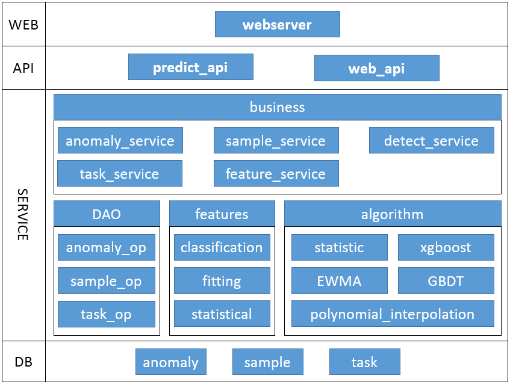

## 时间序列异常检测学件的架构

 

时间序列异常检测工程的整体分层，可以分为以下五层：

1. **数据层（DB）**：存储检测异常信息、样本信息、任务信息等

2. **服务层(SERVICE)**： 服务层划分为两大模块

    1. **数据驱动模块DAO**： 封装了和DB层常见的数据操作接口。
    
    2. **业务模块service**： 完成API层的具体业务逻辑。

3. **学件层(LEARNWARE)**：学件层划分为三大模块
  
   1. **检测模块detect**： 提供时间序列异常检测接口
    
   2. **特征计算模块features**： 提供三类时间序列的特征（统计特征、拟合特征、分类特征）用于对时序数据进行特征提取，在监督学习和训练中使用。

   3. **算法模块algorithm**： 提供常见的几种机器学习算法封装（统计判别算法、指数移动平均算法、多项式算法、GBDT和xgboost等）用于对序数据进行联合仲裁检测。
    
4. **接口层(API)**： 提供API能力，时间序列异常检测接口和WEB管理的操作接口。

5. **WEB层(WEB)**： 系统提供的WEB服务，通过服务界面，用户可以进行异常查询、打标标注、样本库管理、模型训练等操作。