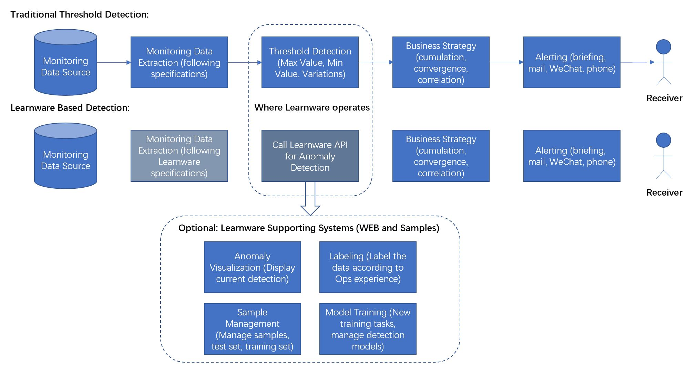

## Learnware
The idea of Learnware was originally proposed by Prof. Zhi-Hua Zhou at Nanjing University [1]. **Learnware = model + specification**. It has three properties: Reusable, Evolvable, and Comprehensible.
Many practitioners might have already established similar model in their applications, and they are willing to find a place to share these models. When a new user wants to develop an app, it’s unnecessary to create a model on their own, instead, they can find a suitable model in “Learnware” marketplace and then modify it according to their needs. Learnware is based on industry adoption, which produces expert level results. There will not be information security issue because only the model is shared.

## Ops Learnware
“Ops Learnware” also known as AI Operations Component, is quite similar to API and libraries in programming. API and libraries do not contain specific business data, they are just some kind of algorithm and logic, however, AI operation component is capable of remembering and saving the solutions and smart rules of certain scenarios in the field of operation and maintenance.
These smart rules are achieved by a mount of training. It has three properties - Reusable, Evolvable, and Comprehensible. It can both take advantage of models produced by expert practitioners an avoid data confidentiality issues.

## Application Scenario

The time series anomaly detection learnware has been polished by extensive monitoring data, and it has a wide range of applications in the field of anomaly detection and operation and maintenance monitoring.

### Features

The time series anomaly detection learnware：

* Anomaly Detection API: provides API of rate prediction and value prediction for time series anomaly detection.

The Time Series Anomaly Detection Learnware Supporting Systems：

* Feature extraction：provides functions to extract statistical features, fitting features and classification
features with dimension up to 90+; Support for adding custom features.
* Anomaly Query: Stash the time series anomalies detected by API for further management such as paging query, indexing, etc.
* Labeling：provides functions of labeling. Labeling/Cancel labeling positive samples and negative samples. Labeled samples are automatically stashed.
* Sample Management: Provides functions for sample management such as query, visualization, editing, deleting, importing, etc.
* Model Management: Provides functions for model management. Support for custom model training.

### Data Applications

* Operating System Data: Suitable for detection of system level monitoring data, such as CPU, memory, disk, traffic, packets, etc.
* Application Data: Suitable for detection of time series data during program execution, such as IO volume, number of calls, customized monitoring metrics, etc.
* KPI Data: Suitable for detection of business KPI data, such as trading volume, income value, online user number, success rate, etc.

### Reference

[1] Zhi-Hua Zhou. *"Learnware: On the Future of Machine Learning"*. National Key Laboratory for Novel Software Technology. 2016