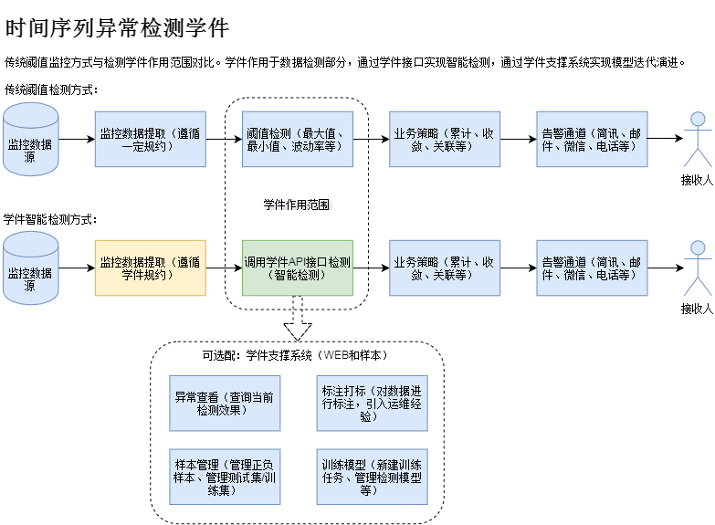

## 学件
“学件”(Learnware)一词由南京大学周志华老师原创，学件(Learnware) = 模型(model) + 规约(specification)，具有可重用、可演进、可了解的特性。
很多人可能在自己的应用中已经建立了类似的模型，他们也很愿意找到一个地方把这些模型分享出去。这样一来，一个新用户想要应用，也许不用自己去建立一个，而是先到“学件”市场上找一找有没有合适的，拿来直接或修改后使用。学件基于专家基础上建立，所以比较容易得到专家级的结果，又因为共享出来的是模型，所以避免了数据泄露和隐私泄露的问题。

## 运维学件
“运维学件”也称为AI运维组件，类似程序中的API或公共库，但API及公共库不含具体业务数据，只是某种算法或者逻辑，而AI运维组件，则是在类似API的基础上，兼具对某个运维场景智能化解决的“记忆”能力，将处理这个场景的智能规则保存在了这个组件中。
这个智能规则是在一定量的数据下学习而来的，且具有“可重用”，“可演进”，“可了解”的特性，既可共享由专家利用数据训练的算法模型，又可保护数据和隐私。

## 应用案例场景

时间序列异常检测学件经过海量监控数据打磨，在异常检测和运维监控告警领域具有广泛的应用性。

### 功能特性

时间序列异常检测学件：

* 异常检测API：提供率值检测和量值检测API接口，对时间序列进行检测

时间序列异常检测学件支撑系统：

* 特征提取：提供三类特征（统计特征、拟合特征、分类特征）的提取功能，特征维度90+；支持增加自定义特征
* 异常查询：经API检测后的时间序列（仅异常）入库存储，提供管理功能，分页查询、检索、放缩等
* 标注打标：提供标注打标的功能，标记/取消标记为正负样本，标记后样本自动转存样本库
* 样本管理：提供样本管理功能，检索、图示、编辑、删除，导入等功能
* 模型管理：提供模型管理功能，支持自定义模型训练

### 应用数据场景

* 操作系统数据：适用于检测操作系统层面的基础监控数据，例如CPU、内存、磁盘、流量、包量等。
* 应用程序数据：适用于检测应用程序运行中记录的时序数据，例如读写量、调用量、自定义监控指标等。
* KPI指标数据：适用于检测业务KPI数据，例如交易量、收入值、在线数、成功率、失败量等业务关键指标。

