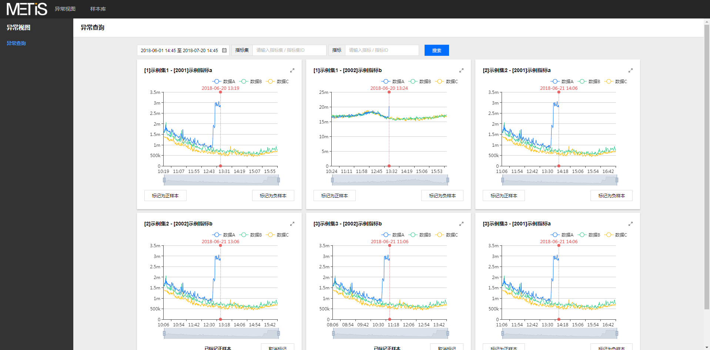
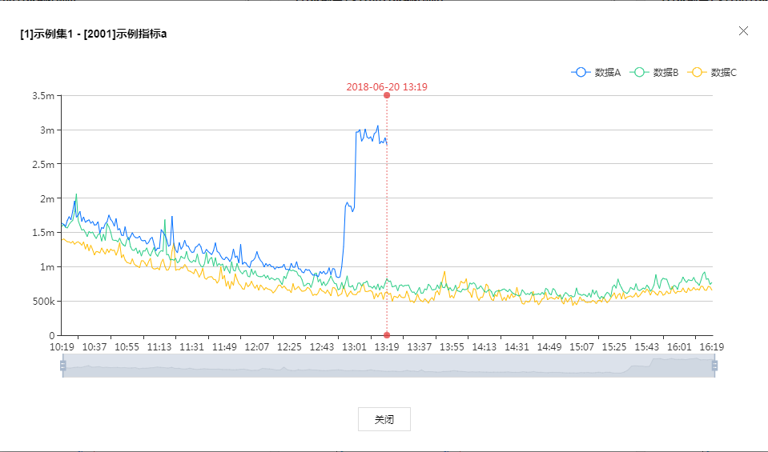
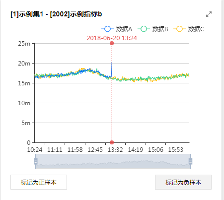
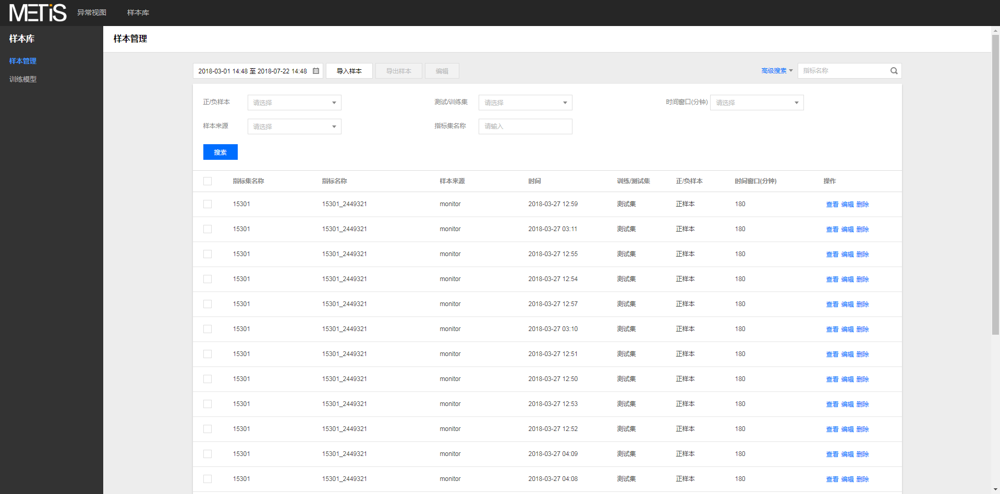
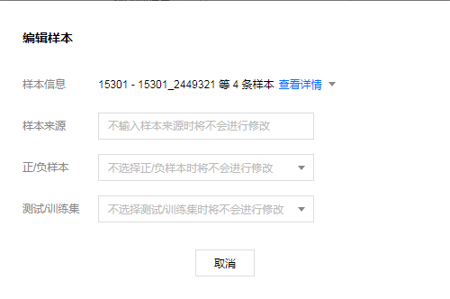
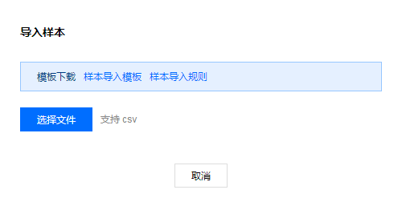
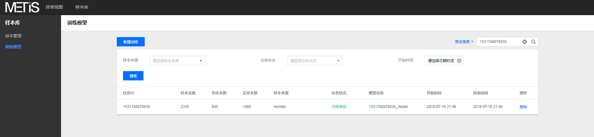
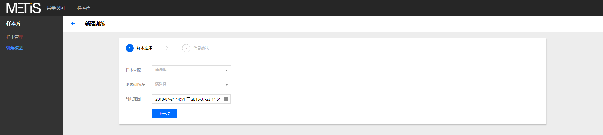
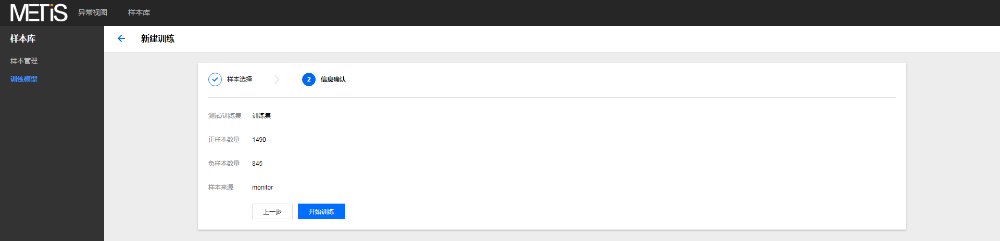

## WEB管理端使用指南

介绍WEB管理端的使用说明，主要包含异常查询、标注打标、样本库管理、训练模型等功能的使用说明

## 异常查询

入口：`异常视图-异常查询` 可查询检测结果为异常的结果信息

1、支持时间、指标集、指标维度联合查询

2、支持曲线交互：查看大图、放缩、曲线选择等

## 标注打标

入口：`异常视图-异常查询` 可对检测结果进行标注，标注后的数据以样本形式转存入样本库

1、支持样本标注，标记为正样本或负样本

2、支持取消标注

## 样本库

入口：`样本库-样本管理` 可对样本数据进行增删改查等基本操作

1、支持时间、样本来源、窗口、分类集等维度联合查询

2、支持单样本查看、编辑、删除操作

3、支持批量编辑、导出操作

4、支持导入样本操作

## 训练模型

入口：`样本库-训练模型` 可根据样本数据进行检测模型的训练，训练的模型可用于异常检测

1、支持时间、样本来源、任务状态等维度联合查询

2、支持删除任务记录

3、支持新建训练任务

